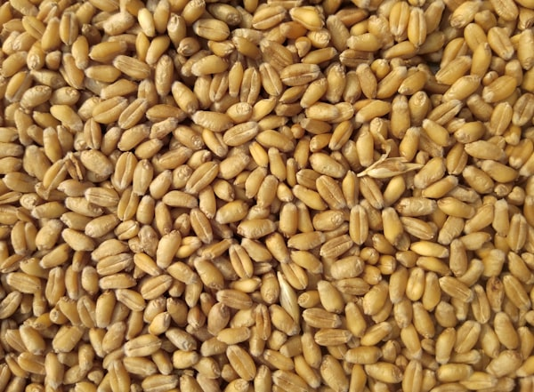

# 🌾 Fasal Doctor v2.0 — Complete Setup Guide

**AI-powered crop disease advisor for Pakistani farmers**
PARC Pakistan × Google Gemini 2.0 Flash × ChromaDB | Bilingual Urdu + English

---

## 📁 Complete Project Structure

```
fasal-doctor/
│
├── frontend/                        ← All HTML files go here
│   ├── index.html                   Home page  (41KB)
│   ├── crops.html                   19 crops with images, filter, modals  (35KB)
│   ├── diagnosis.html               AI diagnosis tool  (36KB)
│   ├── reviews.html                 Farmer reviews + submit form  (25KB)
│   ├── about.html                   About, tech stack, RAG pipeline  (30KB)
│   ├── api.js                       FastAPI client (callDiagnose, checkServerStatus)
│   ├── search-data.js               Global search index (crops + diseases + pages)
│   └── images/                      ← Created by download_images.py
│       ├── hero-bg.jpg              Hero section background
│       ├── crops/                   19 crop images
│       │   ├── wheat.jpg
│       │   ├── cotton.jpg
│       │   ├── rice.jpg
│       │   ├── sugarcane.jpg
│       │   ├── maize.jpg
│       │   ├── brassica.jpg
│       │   ├── gram.jpg
│       │   ├── groundnut.jpg
│       │   ├── barley.jpg
│       │   ├── lentil.jpg
│       │   ├── sorghum.jpg
│       │   ├── millet.jpg
│       │   ├── coriander.jpg
│       │   ├── paddy.jpg
│       │   ├── vegetables.jpg
│       │   ├── tomato.jpg
│       │   ├── potato.jpg
│       │   ├── onion.jpg
│       │   └── chilies.jpg
│       └── features/                6 feature section images
│           ├── ai-diagnosis.jpg
│           ├── pk-brands.jpg
│           ├── bio-control.jpg
│           ├── severity.jpg
│           ├── urdu.jpg
│           └── safety.jpg
│
├── src/
│   ├── rag_engine.py                DO NOT MODIFY — RAG pipeline
│   │   └── exports: get_diagnosis(query, crop_filter, language) → str
│   └── embedder.py                  DO NOT MODIFY
│
├── app/
│   └── streamlit_app.py             DEPRECATED — kept for reference only
│
├── fasal_server.py                  FastAPI backend (project root)
├── download_images.py               Run once to download all images
├── .env                             GOOGLE_API_KEY=your_key_here
└── requirements.txt
```

---

## 🚀 Quick Start (5 Steps)

### Step 1 — Install Python dependencies
```bash
pip install -r requirements.txt
pip install fastapi "uvicorn[standard]" requests python-dotenv
```

### Step 2 — Set your API key
```bash
# Edit .env at project root:
GOOGLE_API_KEY=your_google_gemini_api_key_here
```

### Step 3 — Download all images (run ONCE from project root)
```bash
cd fasal-doctor
python download_images.py
```
Downloads 26 images from Unsplash into `frontend/images/`. Permanent — never breaks.
If some fail, the site shows emoji fallbacks automatically.

### Step 4 — Start the FastAPI backend
```bash
uvicorn fasal_server:app --host 0.0.0.0 --port 8000 --reload
```
Expected output:
```
🔄  Warming up ChromaDB vectors...
✅  RAG engine ready — 671 disease records loaded
📂  Frontend served from: .../fasal-doctor/frontend
INFO:     Uvicorn running on http://0.0.0.0:8000
```

### Step 5 — Open in browser
```
http://localhost:8000/app/index.html
```
Or open `frontend/index.html` directly — works in demo mode without the server.

---

## 🎨 Design System

All pages use **Tailwind CSS** loaded from CDN — no build step needed.

### Fonts (Google Fonts)
| Font | Usage |
|------|-------|
| **Syne** (600,700,800) | All headings, logo, buttons |
| **DM Sans** (400,500,600) | Body text, labels, inputs |
| **Noto Nastaliq Urdu** (400,600,700) | All Urdu text (RTL) |

### Color Palette
```
primary:       #006b2c   (main green)
primary-dark:  #002109   (dark green — hero bg, headers)
surface:       #f8f9ff   (page background)
surface-card:  #ffffff   (card backgrounds)
on-surface:    #0b1c30   (primary text)
on-surface-muted: #3e4a3d (secondary text)
outline:       #6e7b6c   (muted borders)
```

### Custom Tailwind Config (in every page `<head>`)
```javascript
tailwind.config = {
  theme: { extend: {
    colors: {
      primary: '#006b2c', 'primary-dark': '#002109',
      surface: '#f8f9ff', 'surface-card': '#ffffff',
      'on-surface': '#0b1c30', 'on-surface-muted': '#3e4a3d'
    },
    fontFamily: {
      syne: ['Syne', 'sans-serif'],
      dm: ['DM Sans', 'sans-serif'],
      urdu: ['Noto Nastaliq Urdu', 'serif']
    }
  }}
};
```

---

## 📄 Pages — Feature Summary

### index.html — Home Page
- **Hero**: Full-screen wheat field background image, dark gradient overlay, SVG pattern
- **Left column**: Badge pill, giant headline, Urdu title, description, two CTA buttons
- **Stats** (shown ONCE in hero): 671 Disease Records · 19+ Crop Types · 2 Languages · 24/7 AI
- **Right column**: Glassmorphism demo card showing Yellow Rust diagnosis sample
- **Features grid** (3×2): 6 cards each with a real photo + emoji overlay + title + description
- **Crops preview** (6-column grid): 12 crop mini-cards with real photos, +8 More link
- **Purpose note**: Explains what happens when you click a crop card
- **How It Works** (dark green section): 4 numbered steps with connecting line, Urdu subtitle each
- **Testimonials**: 3 review cards with quote mark, stars, Urdu/English text, author, crop tag
- **"Read All Reviews →"** and **"Share Your Story"** buttons → `reviews.html`
- **CTA Band**: Dark gradient, headline, two buttons
- **Footer**: 4-column grid — brand/logo, pages, top crops, data sources

### crops.html — All Crops & Diseases
- **Hero banner**: Dark gradient with page title and Urdu subtitle
- **Filter bar** (sticky): 7 buttons — All(19), Rabi, Kharif, Cereals, Cash Crops, Legumes, Veg/Spice
- **Count bar**: Shows "Showing N crops" + hint to use navbar search
- **NO search bar on page** — search is in navbar 🔍 icon only
- **Grid**: auto-fill cards, min 310px wide. Each card shows:
  - Real crop photo (200px, zoom on hover)
  - Emoji fallback if image missing
  - English name + Urdu name (RTL)
  - Season badge (Rabi/Kharif/Both)
  - Category + Region tags
  - Scientific name + Sowing period
  - Disease count + avg yield loss
- **Modal** opens on click:
  - Full-width crop photo at top with gradient overlay
  - Name/Urdu/scientific name on photo
  - Overview description
  - 2×3 info grid (region, season, sowing, harvest, disease count, yield loss)
  - 2-column disease list (top 10)
  - Farmer tips box
  - CTA → `diagnosis.html?crop=CropName`
- 19 crops total: Wheat, Cotton, Rice, Sugarcane, Maize, Brassica, Gram, Groundnut,
  Barley, Lentil, Sorghum, Millet, Coriander, Paddy, Vegetables, Tomato, Potato, Onion, Chilies

### diagnosis.html — AI Diagnosis Tool
- **Layout**: 280px dark sidebar + flex-1 main content
- **Sidebar** (dark gradient `#001a0a` → `#14532d`):
  - Logo block with Urdu name in #6ee7b7
  - Crop filter `<select>` (19 options)
  - Language radio: Both / English / اردو
  - Stats grid: 671 records · 19+ crops · AI status badge
  - Server status badge (green=online, amber=offline)
  - **Recent Queries** — clearly visible: `color:#d1fae5`, `background:rgba(255,255,255,.12)`, `border-left:3px solid #4ade80`
  - Clear history button
  - Info text + warning box
- **Main area**:
  - Page title (EN + UR)
  - Demo banner (hidden unless server offline)
  - Input card:
    - 7 example chips (clickable, Urdu ones use Noto Nastaliq)
    - Textarea with green border focus
    - **ONE** diagnose button: `🔬 Diagnose | تشخیص کریں` (green gradient)
    - Clear button + crop filter display badge + Ctrl+Enter hint
  - Loading overlay (wheat emoji pulse animation)
  - Response card (appears after diagnosis):
    - Dark header: disease name EN + UR + crop + query preview + severity badge
    - Symptoms section (EN + UR)
    - Treatment table (chemical / brand 🇵🇰 / dose / timing)
    - Safety warning box (amber, Urdu RTL text)
    - Two-column grid: Severity&Losses | Biological Control
  - Tips panel (bilingual)
- **Severity badges**: Critical(red) / High(orange) / Medium(yellow) / Low(green)
- **History**: Saved to `localStorage('fd_hist')`, max 6 items, click to restore

### reviews.html — Farmer Reviews
- **Hero**: Dark gradient with "Farmer Reviews" + Urdu + 3 stats (Avg Rating, Total Reviews, Crops)
- **Submit form**:
  - Name + Location fields (grid)
  - Crop select (14 options) + Language select
  - Interactive star rating (1–5, hover preview, click to select)
  - Textarea (min 20 chars)
  - Submit button → saves to `localStorage('fd_reviews')`
  - Success message appears 5 seconds
- **Filter bar**: All / ★★★★★ / ★★★★ / English / اردو
- **Reviews grid** (auto-fill, min 320px):
  - Quote mark + stars + review text (RTL for Urdu)
  - Author avatar + name + location + date + crop tag
- **8 seed reviews** pre-loaded (mix of Urdu/English, all crops)
- User submissions prepended (newest first), merged with seeds

### about.html — About Page
- Hero banner (dark gradient)
- Mission band (dark, bilingual EN + UR paragraph)
- Stats grid (4 cards): 671, 19+, 2, 98%
- Tech stack (4 cards): Gemini, ChromaDB, PARC, FastAPI
- **2-column layout**: RAG pipeline timeline (left) + PARC info panel (right)
- Timeline: 4 steps with green gradient circles and connecting line
- PARC panel: description + disclaimer + 2×2 dark stats grid
- **Diagnosis output reference**: 6 cards showing what every diagnosis includes
- CTA band + Footer

---

## 🔍 Global Search (all pages)

Every page has a 🔍 icon in the navbar that opens a full-screen search overlay.

**Searches across**: crops, diseases, symptoms, page names, Urdu terms simultaneously.

**Powered by** `search-data.js` — no server needed, instant results.

**How it works**:
```javascript
// Each entry in window.SEARCH_DATA:
{ icon, title, sub, url, text, ur }
// Matches on: text (English) AND ur (Urdu) fields
```

**Add more searchable content** by editing `search-data.js`:
```javascript
window.SEARCH_DATA.push({
  icon: '🦠',
  title: 'New Disease Name',
  sub: 'Crop — severity',
  url: 'diagnosis.html',
  text: 'english keywords for search',
  ur: 'اردو الفاظ',
});
```

---

## 🌐 API Reference

### api.js — Frontend Client

```javascript
// Change this URL to point to your server
const FASAL_API = "http://localhost:8000";

// Main diagnosis call
await callDiagnose(query, cropFilter, language)
// Returns: { success: boolean, response: string, error?: string }
// Falls back to getDemoResponse() if server unreachable

// Status check (used by sidebar badge)
await checkServerStatus()
// Returns: { engine_loaded: bool, disease_records: 671, ... } or null
```

### fasal_server.py — FastAPI Endpoints

| Method | URL | Description |
|--------|-----|-------------|
| `GET` | `/` | Redirects to `/app/index.html` |
| `GET` | `/status` | Engine status (used by diagnosis page sidebar) |
| `GET` | `/crops` | List of 19 crops with EN/UR names |
| `POST` | `/diagnose` | Run AI diagnosis → returns structured text |
| `GET` | `/api/docs` | Swagger UI |

**POST /diagnose request:**
```json
{ "query": "Yellow spots on wheat leaves", "crop_filter": "Wheat", "language": "both" }
```

**POST /diagnose response:**
```json
{ "success": true, "response": "**Disease Name:** Yellow Rust...", "engine_used": "gemini+chromadb" }
```

The `response` field is structured text parsed by `diagnosis.html` with regex to extract:
`Disease Name` · `بیماری کا نام` · `Affected Crop` · `Symptoms English/Urdu` ·
`Spray Chemical` · `Pakistan Brand` · `Dose per Acre` · `Spray Timing` ·
`Severity` · `Yield Loss` · `SAFETY WARNING` block · `BIOLOGICAL CONTROL` block

---

## 🖼️ Images

### Setup (run once from project root)
```bash
python download_images.py
```

### Fallback system
Every image has an emoji fallback — site never breaks if images are missing:
```html

<div style="display:none;">🌾</div>  <!-- always shows if img fails -->
```

### Manual image sources (if download fails)
- **Unsplash.com** — free, no attribution needed
- Search: crop name (e.g. "wheat field", "cotton plant", "rice paddy")
- Save to: `frontend/images/crops/[cropname].jpg`
- Recommended size: 600×400px, JPEG quality 80

---

## ✅ Checklist — Fixed Issues

| Issue | Status |
|-------|--------|
| Duplicate stats (671, 19+, 2, 24/7) shown twice | ✅ Fixed — shows ONCE in hero only |
| Two "Diagnose" buttons | ✅ Fixed — ONE form button only in diagnosis.html |
| Sidebar recent queries invisible (white on dark) | ✅ Fixed — `color:#d1fae5`, visible bg |
| Search bar on crops page | ✅ Removed — search only in navbar 🔍 |
| Wrong crop images (fish for cotton, phone for rice) | ✅ Fixed — corrected Unsplash URLs |
| No reviews page | ✅ Added `reviews.html` with full form + grid |
| No crop images on cards | ✅ All 19 crops have real photos + emoji fallback |
| download_images.py saving to wrong folder | ✅ Fixed — auto-detects location |
| Old `styles.css` file still present | ✅ Removed — all pages use Tailwind CDN |
| No "what does clicking a crop do" explanation | ✅ Added purpose note on home page |

---

## 📝 Coding Rules (for future changes)

1. All pages use **Tailwind CSS CDN** — no `styles.css` file
2. All pages must include `<script src="search-data.js"></script>` and run the search JS
3. All pages must have the **same navbar HTML** structure with identical links
4. Urdu text: always `font-family:'Noto Nastaliq Urdu',serif; direction:rtl;`
5. **Never** add a search input field on any page — search is navbar 🔍 only
6. **diagnosis.html** must have exactly ONE diagnose button (the form button)
7. Stats (671, 19+, 2, 24/7) appear on HOME PAGE HERO only — nowhere else
8. All crop images must have emoji fallback via `onerror` attribute
9. **Never** modify `src/rag_engine.py` or `src/embedder.py`
10. `fasal_server.py` stays at project root (not inside `app/` or `frontend/`)
11. Sidebar text in `diagnosis.html` must use `color:#d1fae5` or lighter
12. Reviews submitted via `reviews.html` are saved to `localStorage('fd_reviews')`
13. The Tailwind config block must be in every page's `<head>` before any Tailwind classes

---

## 🇵🇰 Credits

- **Disease Data**: Pakistan Agricultural Research Council (PARC) — 671 verified records
- **AI Engine**: Google Gemini 2.0 Flash
- **Vector DB**: ChromaDB
- **Images**: Unsplash (free license)
- **Design**: Tailwind CSS + Syne + DM Sans + Noto Nastaliq Urdu
- **Built for**: Pakistani farmers 🌾
